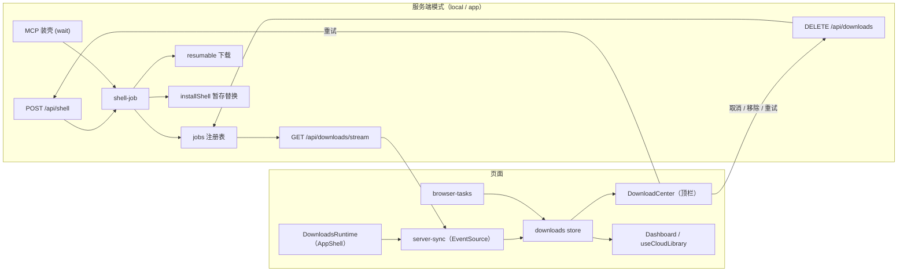

# 下载中心技术方案

> 需求、平台核对与已定决策见 [`download-center.md`](./download-center.md)（下称「需求」）。本文只写实现：模块划分、接口、数据流、协议、测试与实施步骤。
>
> 状态：**已实施**。

## 0. 修订：下载中心只读（2026-10-03，优先于下文）

下载中心只说明"当前有东西在下载"（以后 App 更新也由它承载），不是下载器。下文凡与本节冲突处以本节为准：

- **无用户操作**：去掉取消、重试、移除、「清除已结束」。删除 `DELETE /api/downloads`、`dismissDownloadJob`、`isJobCancelable`（`JOB_NOT_CANCELABLE` 不再存在）；`server-sync` 去掉 `cancelServerDownload` / `removeServerDownload` / `retryServerShellDownload` / `clearFinishedDownloads`。服务端任务的 `AbortSignal` 保留为内部机制（解压子进程、请求超时），界面不触发。
- **浏览器任务无取消**：`BrowserTaskControl` 去掉 `signal`，`BrowserTaskSpec` 去掉 `retry`。`DownloadActions` 只剩 `openDownload` / `pickFile`，由游戏卡片的 `components/dashboard/ShellAwaitFile.tsx` 承接（`useBrowserAwaitFile(kind, gameId)` 查当前游戏等待选文件的任务）；下载中心行只显示提示。
- **只展示进行中**：`DownloadCenter` 只列 `status === 'running'` 的项；没有时整块不渲染（`return null`）。触发按钮为图标 + 任务数角标（`99+` 封顶），去掉平均百分比文字与失败红点（`useUnseenErrorCount` / `markDownloadErrorsSeen` / `selectSummary` 删除）。
- **自动清除**：结束项不在界面出现，结果由 `DownloadsRuntime` 用通知提示。服务端结束任务仍保留 1 小时用于重连补发提示；本页浏览器任务与合成中断项通过 `expireDownload(id)`（`LOCAL_FINISHED_TTL_MS` = 1 小时）从存储移除。
- **连接门禁**：浏览器模式「连接」只在该游戏装壳任务处于 `queued` / `read` / `write` 时禁用（`useBrowserDownloadRunning(kind, gameId, phases)`）。
- **i18n**：删除 `clearFinished` / `clearFailed` / `empty` / `status.*` / `action.cancel|retry|remove` / `toast.taskCreated` / `error.locked|wrongFile|permission`；新增 `awaitFileCard`；"重试"类文案改为"重新下载会接着上次进度"。

## 1. 总体架构



- 页面只有一个数据源：**downloads store**。服务端任务由 `server-sync` 把 SSE 帧写进来，浏览器任务由 `browser-tasks` 直接写入。
- 两条通道互斥：页面属于哪种模式就只启用哪条（dev 切换器切换会整页刷新）。
- **运行时与界面分离**：`DownloadsRuntime` 挂在 `AppShell`（营销首页没有顶栏也挂），负责服务端同步、结束提示、离开确认；`DownloadCenter` 只是顶栏里的展示与操作入口。

## 2. 模块与目录

| 文件                                                          | 职责                                                      | 关键导出                                                                              |
| ------------------------------------------------------------- | --------------------------------------------------------- | ------------------------------------------------------------------------------------- |
| `lib/downloads/types.ts`                                      | 前后端共用类型、百分比                                    | `ServerDownloadJob`、`DownloadStatus`、`downloadPercent`                              |
| `lib/downloads/store.ts`                                      | 页面任务存储（模块级单例，可订阅）                        | `useDownloads`、`upsertDownload`、`removeDownload`、`onDownloadFinished` 等           |
| `lib/downloads/rate.ts`                                       | 速度平滑与剩余时间                                        | `nextRate`、`etaSeconds`                                                              |
| `lib/downloads/server-sync.ts`                                | EventSource 生命周期、快照合并、服务端操作（取消 / 移除） | `startServerDownloadSync`、`cancelServerDownload`、`removeServerDownload`             |
| `lib/downloads/browser-tasks.ts`                              | 浏览器任务运行器：取消、Web Locks、离开确认               | `startBrowserDownload`                                                                |
| `lib/browser/nw-shell-fsa.ts`                                 | 拆出「准备 / 打开下载 / 选文件 / 写入」四步               | `prepareWinShell`、`openOfficialNwDownload`、`pickLocalNwZip`、`writeWinShell`        |
| `lib/browser/cloud-shell-task.ts`（新）                       | 浏览器装壳任务编排（不依赖 React），完成后回写游戏库      | `startCloudShellTask`                                                                 |
| `services/downloads/jobs.ts`                                  | 服务端任务注册表、节流推送                                | `startDownloadJob`、`listDownloadJobs`、`dismissDownloadJob`、`subscribeDownloadJobs` |
| `services/downloads/resumable.ts`                             | 通用可续传下载                                            | `downloadToFile`、`sha256File`                                                        |
| `services/game/nw-download.ts`                                | NW.js 版本、校验值、下载、解压                            | `ensureLatestNwShellSource`、`fetchNwSha256`                                          |
| `services/game/shell.ts`                                      | `installShell` 暂存后替换；Linux 不建 `app.nw`            | `installShell`（签名不变）、`recoverOldIfNeeded`                                      |
| `services/game/shell-job.ts`                                  | NW.js 下载安装任务                                        | `startLatestShellJob`                                                                 |
| `app/api/downloads/route.server.ts`                           | 列表、取消 / 移除                                         | `GET`、`DELETE`                                                                       |
| `app/api/downloads/stream/route.server.ts`                    | SSE                                                       | `GET`                                                                                 |
| `app/api/shell/route.server.ts`                               | `fetchLatest` 改后台任务，`wait` 同步                     | `POST`                                                                                |
| `components/downloads/DownloadCenter.tsx`                     | 顶栏入口 + Popover                                        | `DownloadCenter`                                                                      |
| `components/downloads/DownloadItemRow.tsx`                    | 单个任务行                                                | `DownloadItemRow`                                                                     |
| `components/downloads/DownloadsRuntime.tsx`                   | 挂在 `AppShell`：启停服务端同步、结束提示、离开确认       | `DownloadsRuntime`                                                                    |
| `components/AppShell.tsx`                                     | 挂载 `DownloadsRuntime`                                   | —                                                                                     |
| `app/api/launch/route.server.ts`、`app/api/status/route.ts`   | 解析游戏状态前调 `recoverOldIfNeeded`                     | —                                                                                     |
| `lib/i18n/messages/parts/downloads.ts` + `downloads-types.ts` | 四语文案，不撑大 `types.ts`                               | `downloadsZh/En/Ja/Ko`、`DownloadsMessages`                                           |

所有新文件预计都在 300 行以内；`components/downloads/` 是新目录，和 `components/dashboard/` 同级。

## 3. 共用类型（`lib/downloads/types.ts`）

```ts
export type DownloadStatus = 'running' | 'done' | 'error' | 'canceled'

export type ServerDownloadKind = 'nw-shell'
export type ServerDownloadPhase = 'resolve' | 'download' | 'extract' | 'install'

export type ServerDownloadJob = {
  id: string
  kind: ServerDownloadKind
  status: DownloadStatus
  phase: ServerDownloadPhase
  version?: string
  receivedBytes?: number
  totalBytes?: number
  resumedFrom?: number
  error?: string
  startedAt: number
  finishedAt?: number
  result?: Record<string, unknown>
}

/** 浏览器任务阶段：prepare 拉版本 / 查缓存 → awaitFile 等用户下载并选文件 → queued 等待页面内读写锁 → read 读取并写缓存 → write 写入游戏目录 */
export type BrowserDownloadPhase = 'prepare' | 'awaitFile' | 'queued' | 'read' | 'write'

/** 运行中且不在安装阶段才可取消 */
export function isJobCancelable(job: Pick<ServerDownloadJob, 'status' | 'phase'>): boolean
```

## 4. 服务端

### 4.1 任务注册表（`services/downloads/jobs.ts`）

```ts
type JobEvent = { type: 'job'; job: ServerDownloadJob } | { type: 'removed'; id: string }

startDownloadJob(kind, run: (ctl: { signal: AbortSignal; update(patch): void }) => Promise<Record<string, unknown> | void>)
  : { job; done: Promise<ServerDownloadJob>; reused: boolean }
listDownloadJobs(): ServerDownloadJob[]
dismissDownloadJob(id): 'canceled' | 'removed' | 'not-cancelable' | 'absent'
findRunningJob(kind): ServerDownloadJob | undefined   // 给 /api/shell 做 409 互斥
subscribeDownloadJobs(listener: (e: JobEvent) => void): () => void
```

- 状态挂在 `globalThis.__chayaDownloadJobs`（dev 热更新不丢）。
- 同种类只跑一个：`startDownloadJob` 发现同 `kind` 运行中，返回 `reused: true` 和原任务。
- **推送节流**：`update()` 只改内存对象并标脏；每个任务一个 250 ms 定时器，到点推一次最新快照。阶段变化（`phase` 改变）和结束（`status` 离开 `running`）绕过节流立即推，并清掉待推定时器。
- 结束的任务保留 1 小时、最多 20 条；淘汰时推 `removed`。
- 取消：`abort.abort(new Error('已取消'))`；`run` 抛错且 `signal.aborted` 时记 `canceled`，否则记 `error`。
- 安装阶段 `dismissDownloadJob` 返回 `not-cancelable`，不触发中止。
- `run` 成功返回时即使已请求取消，也记 `done`（结果以实际为准）。

### 4.2 可续传下载（`services/downloads/resumable.ts`）

```ts
downloadToFile(url, dest, {
  signal?, onBytes?(p: { receivedBytes; totalBytes?; resumedFrom }), idleTimeoutMs = 60_000, sha256?, label?
}): Promise<{ resumedFrom: number }>
```

流程：

1. `existing = size(dest + '.part')`；`existing > 0` 时请求头带 `Range: bytes=<existing>-`。
2. 内部 `AbortController` 合并外部 `signal` 与空闲定时器（每收到一块数据重置；超时以 `Error('…秒未收到数据，重试会接着下载')` 中止）。空闲定时器只覆盖网络阶段，响应体读完即清除，不影响后面的 SHA-256 计算。
3. 按状态码分支：

| 状态码（`existing = 0` 时不带 Range；若仍收到 206，要求 `start = 0`，否则按下面"非法"处理）            | 写入方式                                        | 总长                   | 起点                        |
| ------------------------------------------------------------------------------------------------------ | ----------------------------------------------- | ---------------------- | --------------------------- |
| `206` 且 `Content-Range` 为 `bytes start-end/total`，`start = existing`、`end >= start`、`total > end` | 追加（`flags:'a'`）                             | `total`                | `existing`                  |
| `206` 但 `Content-Range` 缺失或上述条件不满足                                                          | 丢弃响应、删除 `.part`，不带 Range 重新请求一次 | —                      | 0                           |
| `200`                                                                                                  | 覆盖（`flags:'w'`）                             | `Content-Length`       | 0                           |
| `416` 且 `existing>0`，`Content-Range: bytes */total` 的 `total = existing`                            | 不写                                            | `Content-Range` 的总长 | 视为可能已完整，跳到第 5 步 |
| `416` 的总长缺失或不等于 `existing`                                                                    | 丢弃响应、删除 `.part`，不带 Range 重试一次     | —                      | 0                           |
| 其它                                                                                                   | 抛错，保留 `.part`                              | —                      | —                           |

4. 流经计数 `Transform` 上报 `onBytes`，`pipeline(..., { signal })` 写入 `.part`。
5. 有总长且 `size(.part) !== 总长`：抛"下载不完整"，保留 `.part`。
6. 有 `sha256`：流式计算 `.part` 的 SHA-256，不符则删除 `.part` 并抛错。
7. `.part` 改名为 `dest`。

失败默认保留 `.part`；只有校验不符，或者 206 / 416 明确证明本地部分与源端区间不相容时删除并从头重试一次。从头重试仍返回非法区间时报错，不循环重试。错误优先抛中止原因（取消 / 超时文案），否则抛原始错误。

### 4.3 NW.js 流程（`nw-download.ts` + `shell-job.ts`）

`ensureLatestNwShellSource(opts)` 新增 `signal`、`onProgress`：

1. `onProgress({ phase: 'resolve' })` → `fetchVersionsJson(signal)`（8 秒超时）。用 `AbortSignal.any([signal, AbortSignal.timeout(...)])` 合并任务取消与超时。
2. 命中 `extract/` 缓存 → 直接返回（跳过 3–6）。
3. `fetchNwSha256(version, archiveName, signal)`：取 `https://dl.nwjs.io/<ver>/SHASUMS256.txt`（10 秒超时），按 `<hash>  <文件名>` 匹配。超时或网络失败返回 `undefined`；任务 `signal` 取消必须继续抛出，不能被当成"取不到校验值"后继续下载。
4. 压缩包已存在（上次解压被取消）且有校验值 → `sha256File` 校验，不符则删除；校验通过记 `verified = true`。
5. 压缩包不存在 → `downloadToFile(url, archive, { signal, sha256, onBytes → onProgress({ phase: 'download', … }) })`；带 `sha256` 下载成功即 `verified = true`。
6. `onProgress({ phase: 'extract' })` → 解压（`spawn` 带 `signal`）。失败时：总是删除解压目录；`signal.aborted`（取消）保留压缩包；非取消且 `!verified` 删除压缩包；非取消且 `verified` 保留压缩包并在错误里带原始信息。
7. 解压成功删除压缩包（现有）。

`startLatestShellJob(contentRoot)`：把上述进度映射为 `update()`，`signal.throwIfAborted()` 后进入 `install`，调用 `installShell({ force: true })` 与 `saveConfig`，再 `pruneShellCacheParts(keepVersionDir)` 删除其它版本目录里的 `.part` 与压缩包（不动解压目录，失败忽略），返回 `{ ...installResult, nw }` 作为 `result`。`contentRoot` 在任务启动时固定，只用于 macOS 的 `app.nw`；启动游戏时 `ensureShellLinkedToContent` 会按当前游戏重链。

### 4.4 `installShell` 暂存后替换（`services/game/shell.ts`）

只改 `force` 且已有壳的分支，以及首次安装的复制方式；不改签名与返回值。

```text
dir     = dirname(shellApp)          // data/shell
staging = dir/.<name>.staging
old     = dir/.<name>.old

recoverOldIfNeeded()                 // 见下方规则；安装、启动、读取状态前都调用
cleanup(staging)                     // staging 可直接清理
if (validShellExists(shellApp)) cleanup(old)   // 正式壳可用时才可清理 old
cpSync(source → staging, 现有 filter)
if (darwin) linkContent(staging/Contents/Resources/app.nw → contentRoot)
if (pathEntryExists(shellApp)):     // 含失效链接 / 残缺目录，一并挪走
  renameWithRetry(shellApp → old)    // Windows 被占用 → 删 staging，抛 SHELL_IN_USE
renameWithRetry(staging → shellApp)  // 失败 → 尝试 old 改回 shellApp
                                      // 回滚也失败 → 保留 old，抛 SHELL_SWAP_RECOVERY_REQUIRED
if (validShellExists(shellApp)) rmSync(old)   // 失败忽略；正式壳不可用时绝不删 old
```

- `renameWithRetry`：`EPERM` / `EBUSY` / `EACCES` 时间隔 200 ms 重试 3 次（同步等待用 `Atomics.wait` 在 `SharedArrayBuffer` 上休眠，避免改成异步牵动调用方）。
- 用户可见错误："游戏正在运行（共用壳被占用），请退出游戏后点重试"。
- macOS 链接：`app.nw` 是指向内容根的绝对路径符号链接，改名后仍有效；随后的"已有壳且未变内容根"分支照旧只做重链。
- `recoverOldIfNeeded` 是 `services/game/shell.ts` 的共用恢复函数，导出给三处调用，且都在 `getResolvedFromConfig()` **之前**：
  - `installShell` 开头；
  - `app/api/launch/route.server.ts` 开头（否则 `resolved.hasShell === false` 会先返回"尚未安装壳"，走不到 `ensureShellLinkedToContent`；而 Windows / Linux 在 `ensureShellLinkedToContent` 里会提前返回，放在那里也不生效）；
  - `GET /api/status` 开头（让界面上的"已装壳"状态正确）。
    恢复失败时错误带 `.old` 绝对路径，方便手动恢复。
- **两种"存在"分开判断**，不能混用：
  - `pathEntryExists(p)`：`fs.lstatSync` 不抛 `ENOENT` 即为真，不跟随符号链接。只回答"这个路径名是否被占用"（包括失效符号链接），用于改名、清理前判断目标位置是否要先挪走。
  - `validShellExists(p)`：路径能解析到真实目录，且按平台能找到壳可执行文件（复用现有解析壳可执行文件的逻辑）。用于"是否需要恢复""能否删除 `.old`""是否已装壳"。
- **`recoverOldIfNeeded` 规则**：

  | 正式路径                             | `.old`             | 处理                                                                                                                                            |
  | ------------------------------------ | ------------------ | ----------------------------------------------------------------------------------------------------------------------------------------------- |
  | `validShellExists`                   | 任意               | 不动（`.old` 留给安装成功后清理）                                                                                                               |
  | 不可用（不存在、失效链接、残缺目录） | `validShellExists` | 正式路径若 `pathEntryExists`：符号链接 / 文件直接 `unlink`，真实目录改名为 `.<name>.broken`（覆盖上次的 `.broken`）；然后 `.old` 改名为正式路径 |
  | 不可用                               | 不存在或不可用     | 不动，按未装壳处理；不删除任何东西                                                                                                              |

  任一步失败抛 `SHELL_SWAP_RECOVERY_REQUIRED`，带 `.old` 绝对路径；`.old` 只在正式壳 `validShellExists` 时才允许删除。

- **Linux 修复**：`installShell` 与 `ensureShellLinkedToContent` 的分支条件从 `isWin32()` 改为"是否 macOS"（`process.platform === 'darwin'`）；Windows / Linux 都不建 `app.nw`，由启动参数传内容根（`services/platform/host/{windows,linux}.ts` 已如此）。
- `installShell` 全程同步（`cpSync`、`renameSync`、`Atomics.wait`），同一 Node 进程里的启动 / 状态请求不会插进替换中间，无需加锁；待恢复状态只可能来自进程在替换中途崩溃。

### 4.5 路由

**`POST /api/shell`**

| 请求体                              | 响应                                                                           |
| ----------------------------------- | ------------------------------------------------------------------------------ |
| `{ fetchLatest: true }`             | `202 { ok, job, reused }`                                                      |
| `{ fetchLatest: true, wait: true }` | 任务成功：`200 { ok, ...result, job }`；失败 / 取消：`400`，信息取 `job.error` |
| `{ shellSource, force? }`           | 不变（同步，但安装同样走暂存替换）                                             |

`findRunningJob('nw-shell')` 存在时：`POST { shellSource }` 与 `DELETE /api/shell` 返回 `409 SHELL_JOB_RUNNING`；`POST { fetchLatest }` 返回运行中的任务（`reused`）。

**`GET /api/downloads`** → `{ ok, jobs }`；**`DELETE /api/downloads?id=`** → `{ ok, result: 'canceled' | 'removed' }`，安装阶段 `409 JOB_NOT_CANCELABLE`，不存在 `404`。两者都先 `requireDisk()`。

**`GET /api/downloads/stream`**（SSE，`dynamic = 'force-dynamic'`，头同 `/api/logs/stream`，不加 `Access-Control-Allow-Origin: *`，只给同源页面用）：

| 事件       | 数据                            | 时机                   |
| ---------- | ------------------------------- | ---------------------- |
| `snapshot` | `{ jobs: ServerDownloadJob[] }` | 连接建立时一次         |
| `job`      | `ServerDownloadJob`             | 任务新增 / 进度 / 结束 |
| `removed`  | `{ id }`                        | 任务被移除或过期淘汰   |
| `ping`     | `{ ts }`                        | 每 15 秒               |

`request.signal` 中止时退订并关闭流；`requireDisk()` 不通过时直接返回 501（不建流）。

### 4.6 MCP

`chaya_game_shell_install` 不传 `shellSource` 时发 `{ fetchLatest: true, wait: true }`。MCP 请求被中止不会取消任务（任务不持有请求的 `signal`）。目录描述补一句"进度同时显示在控制台右上角下载中心"。

## 5. 前端

### 5.1 下载存储（`lib/downloads/store.ts`）

```ts
type DownloadItem = {
  id: string // 'srv:<jobId>' | 'web:<uuid>'
  channel: 'server' | 'browser'
  kind: 'nw-shell'
  status: DownloadStatus
  phase: ServerDownloadPhase | BrowserDownloadPhase
  version?: string
  gameId?: string
  gameName?: string // 浏览器任务
  receivedBytes?: number
  totalBytes?: number
  resumedFrom?: number
  doneCount?: number
  totalCount?: number // 浏览器写入阶段按文件数
  rate?: number // 字节/秒，平滑后
  error?: string
  startedAt: number
  finishedAt?: number
}

type DownloadActions = { cancel?(): void; retry?(): void; remove(): void; openDownload?(): void; pickFile?(): void }
```

- 列表用不可变数组 + `useSyncExternalStore`；操作函数放在 `Map<id, DownloadActions>` 侧表（不进快照，避免每帧比较函数）。
- 导出：`useDownloads()`、`useDownloadActions(id)`、`upsertDownload(item, actions?)`、`patchDownload(id, patch)`、`removeDownload(id)`、`onDownloadFinished(listener)`、`requestDownloadCenterOpen()` / `onDownloadCenterOpenRequest(listener)`、`unseenErrorCount` 相关。“清除已结束”不做成纯 store 操作，因为服务端项还必须调接口删除。
- `patchDownload` 带字节数时由 `rate.ts` 计算速度：只用相邻两次采样的差值（第一次采样只记基准，续传起点不计入），两次采样间隔 ≥ 500 ms 才更新，指数平滑 `rate = 0.3·瞬时 + 0.7·旧值`；`etaSeconds = (total - received) / rate`，速度低于 1 KB/s 或无总长时不给。
- **结束事件**：存储用"已通知 ID 集合"保证每项只触发一次 `onDownloadFinished(item)`。触发条件：该项此前在本页是 `running`，或此前从未见过、首次出现即为终态（规则详见 §5.2"结束事件补发"）。首次快照只建立基线，其中已结束的项直接写入并记为已通知，不触发。
- **触发按钮摘要** `selectSummary(items)`：进行中的项都有百分比 → 平均百分比；否则 → 进行中个数。
- 浏览器项最多保留 50 条（超出时丢最早的已结束项）；服务端项以服务端列表为准。

### 5.2 服务端同步（`lib/downloads/server-sync.ts`）

```ts
startServerDownloadSync(): () => void   // DownloadsRuntime 挂载时调用，返回停止函数（引用计数）
cancelServerDownload(jobId) / removeServerDownload(jobId)   // DELETE /api/downloads?id=
retryServerShellDownload(failedJobId)   // POST /api/shell { fetchLatest: true }，成功后移除指定的旧失败项
```

- **启用条件**：`BUILD_TARGET !== 'edge'` 且 `/api/status` 返回 `canUseDisk === true`。`DownloadsRuntime` 自己拉一次状态（不复用 `GameLinkProvider` 的 `browserMode`，见需求 §3.2）；dev 切换器切换后整页刷新（`DevTargetSwitch` 调 `location.reload()`），挂载时判断一次即可，不处理运行中切换。
- `snapshot`：服务端项以快照为准整体替换，因此其它标签页移除的已结束项在重连后也会消失。唯一例外：快照里没有、而本地仍是 `running` 的项，转成仅本页的合成 `error` 项（"服务已重启，任务中断，重试会接着下载"），保留到本页用户移除；store 用侧表标记这类项，后续快照不再误删。
- **合成项只在本页**：移除、清除已结束、重试成功后的清理都只删本地，不调 `DELETE`（服务端没有这个 ID）。
- **结束事件补发**：页面生命周期内第一份快照只建立基线，不触发结束事件。之后的快照 / `job` 帧里，凡是本页记录为 `running`、或本页从未见过的终态项，都触发 `onDownloadFinished`（同一 ID 只触发一次）。这样后台期间由 MCP 发起并完成的任务，回到前台也会提示并让游戏库刷新。
- `job` → `upsertDownload`；`removed` → `removeDownload`。
- 断线由 EventSource 自动重连，重连后的 `snapshot` 负责纠正状态。
- **可见性**：`document.visibilityState === 'hidden'` 时关闭 EventSource，`visible` 时重开（HTTP/1.1 下同主机最多 6 个连接，多标签页常驻 SSE 会把连接占满）。重开后的快照按"结束事件补发"规则处理：之前在进行中的、以及期间新建且已结束的任务都补发一次。
- `removeServerDownload` / 清除已结束：服务端列表全局共享，移除对所有页面生效；等服务端推 `removed` 后再从本页删除，不做乐观删除。`DELETE` 返回 `404`（已被其它页面移除或已过期）视为成功，直接从本页删除。底部“清除已结束”对每个服务端终态项调一次 `DELETE`（最多 20 条），浏览器终态项直接从本页 store 移除；失败的服务端项保留并给一次汇总错误提示。
- `retryServerShellDownload(failedJobId)` 使用当前选中的游戏；请求成功（包括 `reused: true`）后再删除指定的旧失败 / 取消项。真正新建的任务使用新 ID，`reused: true` 则展示已在运行的 ID。服务端返回"未选择游戏"等错误时保留旧项并直接提示。
- 发起服务端任务（Dashboard 确认、重试）后调用 `requestDownloadCenterOpen()`，下载中心自动展开一次。

### 5.3 浏览器任务运行器（`lib/downloads/browser-tasks.ts`）

```ts
startBrowserDownload(spec: {
  kind: 'nw-shell'; gameId: string; gameName: string; lockKey: string
  run(ctl: { signal: AbortSignal; update(patch: Partial<DownloadItem>): void; waitForFile(): Promise<Uint8Array> }): Promise<void>
  onDone?(): Promise<void> | void
}): Promise<{ id: string } | { error: 'locked' }>
```

- **Web Locks**：`navigator.locks.request(lockKey, { ifAvailable: true }, cb)` 本身是异步 API，因此 `startBrowserDownload` 异步返回“获锁结果”。实现用一个独立的 acquisition Promise：callback 拿到 `lock` 后立即 resolve `{ id }`，然后 callback 继续 `await run()` 以持有锁；外层不等整个 `navigator.locks.request()` 完成，否则会等到任务结束才返回。拿不到锁返回 `locked`，调用方提示"另一个页面正在为此游戏安装壳"。不支持 Web Locks 时退化为当前标签页内的 `Set` 去重。
- **取消**：`AbortController`；`writeWinShell` 每写一个文件检查 `signal`。
- **等待选文件**：`waitForFile()` 把阶段设为 `awaitFile`，并给任务挂上 `openDownload` / `pickFile` 两个操作；`pickFile` 在用户点击里执行（先 `queryPermission`，非 `granted` 则 `requestPermission`，再 `pickLocalNwZip`），选中后 resolve。`waitForFile()` 同时监听 `signal`，取消时 reject 并清理待决 Promise 与任务操作，不留永不结束的任务。
- **读写排队**：进入 `read` 前排队获取**模块内的串行队列**（Promise 链，不用 Web Locks：Web Locks 按源跨标签页生效，会让一个标签页无谓地等另一个标签页），等待期间阶段为 `queued`；`write` 结束或任务取消 / 失败时出队。内存压力是按标签页计的，标签页内串行就够。
- **离开确认**：存在 `read` / `write` 阶段的任务时注册 `beforeunload`（`preventDefault()`），全部结束后移除；由 `DownloadsRuntime` 订阅存储统一处理。
- 浏览器任务不支持"重试"续用旧任务：重试 = 移除旧项 + 重新 `startCloudShellTask`（写入阶段靠跳过已写文件续上）；重试按钮的点击处理第一步同样是 `requireCloudPermission`。

### 5.4 浏览器装壳拆分

`lib/browser/nw-shell-fsa.ts`：

```ts
prepareWinShell(): Promise<{ version; fileKey; archiveName; url; cached: Uint8Array | null }>   // 拉版本 + 读 OPFS
openOfficialNwDownload(url): void
pickLocalNwZip(archiveName): Promise<Uint8Array>   // 已有，改为导出
cacheNwZip(version, fileKey, data): Promise<void>  // 已有 writeZipToOpfs，改为导出
writeWinShell(projectRoot, zip, { signal?, onProgress? }): Promise<void>   // 解压 + writeZipEntriesResume + nw.exe 检查
installWindowsShellFsa(...)                         // 保留为组合函数（测试 / 兼容）
```

`writeZipEntriesResume` 的进度从拼好的中文 `message` 改为结构化 `{ done, total, skipped }`，文案交给 i18n。

- **选文件校验**（`pickFile` 内）：文件名去掉 ` (数字)` 后缀后必须等于 `archiveName`，否则抛 `WRONG_FILE`（提示期望文件名），任务保持 `awaitFile`。浏览器拿不到 `SHASUMS256.txt`（无 CORS），只能文件名 + 解压后检查 `nw.exe`。
- **缓存损坏**：OPFS 缓存的压缩包 `unzipSync` 失败时删除该缓存文件，任务回到 `awaitFile`。

`lib/browser/cloud-shell-task.ts`（`async startCloudShellTask(entry)`）：

1. 调用方在点击处理的第一行 `await requireCloudPermission(game)`（任何其它 `await` 之前）。
2. `await startBrowserDownload({ lockKey: 'chaya-shell:<gameId>', run })`，`run` 内：`prepare` → 未命中缓存则 `openOfficialNwDownload` + `await waitForFile()` → `read`（`cacheNwZip`）→ `write`（`writeWinShell`）→ `writeShellLaunchers(game.picked, 'win')`。
3. `onDone`：`inspectCloudGame` 重新检查 → 读 `cloudLibraryStorage()`，**条目还在**才替换后写回（任务期间被移出游戏库则跳过，不把它加回来）→ 派发 `window` 事件 `chaya:cloud-library-changed`。`useCloudLibrary` 监听该事件重新加载，所以用户离开游戏库页后任务照样能落盘。
4. 成功提示带 SmartScreen 说明（需求 O4）。

`installCloudShell` 只保留 macOS（抛"用终端"）与 Linux（返回下载链接）分支；Windows 分支改由 `startCloudShellTask` 处理。

### 5.5 WebMCP（`components/webmcp/edge/game.ts`）

浏览器模式的 `chaya_game_shell_install` 改为调用 `startCloudShellTask`：缓存命中时等待任务完成再返回；未命中时立即返回"已在右上角下载中心创建任务，请用户下载官方压缩包并点「选择已下载的压缩包」"（Agent 调用没有用户手势，弹不出文件框）。目录权限只用 `queryPermission` 检查（`requestPermission` 没有用户手势会失败），未授予时返回错误让用户先在页面上操作一次。

### 5.6 界面组件

- `DownloadCenter`：base-ui `Popover`（`@base-ui/react/popover`）。Trigger 用 `dropdownTriggerClass` + `LuDownload`（15px）；运行中显示总百分比或进行中个数（`sm` 以下只留图标）；`unseenErrorCount > 0` 显示红点，打开时清零。Positioner 参数与 `LocaleSwitcher` 一致（`side="bottom" align="end" sideOffset={6} collisionPadding={8} positionMethod="fixed" className="z-[70]"`，有 ShadowRoot 时 Portal 进去）。Popup 用 `dropdownPopupClass` 加宽到约 22rem，内容区最大高度约 60vh 可滚动。
- `DownloadItemRow`：标题（`NW.js {version}`，版本未知时 `NW.js`）、通道 + 游戏名（仅浏览器任务）、阶段文案、进度条（复用 `TranslateRunPane` 里 `role="progressbar"` 的写法，支持不确定态）、大小 / 速度 / 剩余时间、操作按钮（`TextAction` 或 `Button` 的小号）。
- 可访问性：Trigger 有本地化 `aria-label`，Popover 沿用 base-ui 的焦点进入 / 返还、Escape 和点击外部关闭；任务操作可键盘到达。成功 / 失败通过现有通知的 live region 播报。程序化“自动展开一次”只打开面板，不将焦点从用户当前操作处抢走；用户主动点 Trigger 时才按 Popover 默认规则移动焦点。
- `DownloadsRuntime`：挂载时判断启用条件并 `startServerDownloadSync()`；订阅 `onDownloadFinished`，成功 `notify.success`，失败 `notify.error`（附"重试会接着下载"），取消不提示；订阅存储维护 `beforeunload`。不渲染任何 DOM。
- `AppTopBar`：顺序为 `<DevTargetSwitch />`（仅 dev，永远第一个）→ `{end}` → `<DownloadCenter />` → `<LocaleSwitcher />`；`AppShell`：在 `AppProviders` 内部挂 `<DownloadsRuntime />`（需要 `useNotification`）。

### 5.7 Dashboard 接入

- `useDashboardActions.fetchLatestShell`：`onConfirm` 只 `POST` 并 `requestDownloadCenterOpen()`；HTTP 失败时提示并保持弹窗可关（不再 `setBusy`）。确认文案去掉"请先退出游戏"，改为说明 Windows 上游戏运行中安装会失败、退出后重试即可。
- 服务端模式用 `useServerDownloadRunning('nw-shell')`：为真时禁用共用壳菜单里的「安装 / 下载最新 / 升级 / 卸载」。浏览器模式必须用 `useBrowserDownloadRunning('nw-shell', gameId)` 按游戏禁用，不能只按 `kind` 误锁其它游戏。
- Dashboard 订阅 `onDownloadFinished`：`kind === 'nw-shell'` 且 `status` 为 `done` 或 `error` 时 `refresh()`（失败也可能改变了壳状态，例如回滚或恢复后）。
- 浏览器模式：`useCloudLibrary.installShell` 改为调用 `startCloudShellTask`，删除 `progress` 状态与卡片补充信息里的进度文字（保留 Linux 的 `downloadUrl` 链接）；只禁用该游戏的「安装壳」「连接」。

## 6. i18n（`downloads` 命名空间）

| 键                                                          | 中文示例                                                                                 |
| ----------------------------------------------------------- | ---------------------------------------------------------------------------------------- |
| `title` / `triggerAria` / `empty` / `clearFinished`         | 下载 / 下载管理 / 暂无下载 / 清除已结束                                                  |
| `running`                                                   | {count} 个进行中                                                                         |
| `channel.server` / `channel.browser`                        | 服务端 / 浏览器                                                                          |
| `kind.nwShell`                                              | NW.js {version}                                                                          |
| `phase.resolve/download/extract/install`                    | 查询版本 / 下载中 / 解压中 / 安装中                                                      |
| `phase.prepare/awaitFile/queued/read/write`                 | 准备中 / 等待浏览器下载 / 排队中 / 读取中 / 写入中                                       |
| `status.done/error/canceled`                                | 已完成 / 失败 / 已取消                                                                   |
| `size` / `speed` / `eta` / `resumedFrom` / `files`          | {received} / {total} · {speed}/s · 剩余约 {eta} · 从 {size} 续传 · {done}/{total} 个文件 |
| `action.cancel/retry/remove/openDownload/pickFile`          | 取消 / 重试 / 移除 / 打开官方下载 / 选择已下载的压缩包                                   |
| `toast.shellDone` / `toast.shellFailed` / `toast.retryHint` | 已安装 NW.js {version} / 下载 NW.js 失败 / 重试会接着下载                                |
| `error.locked` / `error.interrupted` / `error.wrongFile`    | 另一个页面正在为此游戏安装壳 / 服务已重启，任务中断 / 请选择 {name}                      |

服务端错误文案（中文）原样展示，与现有接口一致。字节格式化复用 `lib/format-bytes.ts`。

## 7. 错误与边界

| 场景                                               | 处理                                                                  |
| -------------------------------------------------- | --------------------------------------------------------------------- |
| 重复点击下载最新壳                                 | 服务端返回运行中的同一任务（`reused`），页面只展开下载中心            |
| 下载中刷新页面 / 开新标签页                        | 新连接的 `snapshot` 带回运行中任务                                    |
| 服务进程重启                                       | 快照里没有该任务 → 页面标记中断；`.part` 在盘上，重试续传             |
| 取消发生在安装阶段                                 | 界面不提供取消；接口返回 `409 JOB_NOT_CANCELABLE`，任务继续           |
| 磁盘写满                                           | 任务 `error`，带系统错误；`.part` 保留                                |
| dev 切到 Edge                                      | 整页刷新，重新按条件判断（浏览器任务随刷新丢失，同普通刷新）          |
| 浏览器任务进行中切换游戏                           | 继续写原游戏（持有原句柄）；按游戏 id 禁用对应按钮                    |
| 浏览器任务中目录授权失效                           | `write` 抛错 → 任务失败，提示重新点击安装（届时重新请求授权）         |
| 浏览器任务中刷新页面                               | 离开确认；确认离开后任务丢失，已写文件保留                            |
| 任务运行中经 MCP 指定壳源安装 / 卸载               | `409 SHELL_JOB_RUNNING`                                               |
| 安装阶段调取消接口                                 | `409 JOB_NOT_CANCELABLE`                                              |
| 正式路径是失效符号链接 / 残缺目录，`.old` 是可用壳 | 挪开正式路径后用 `.old` 恢复（见 §4.4）                               |
| 上次替换中途进程退出或回滚失败                     | 保留 `.old`；下次安装、启动或读取状态前恢复，恢复失败则报错并保留副本 |
| 多标签页 / 后台标签页                              | 只有可见标签页连 SSE；回到前台重连补齐，补发期间的结束提示            |
| 打开页面时已有结束的任务                           | 列表里显示，不弹提示                                                  |
| 解压中取消                                         | 保留压缩包，重试直接解压                                              |
| 选错压缩包                                         | 提示期望文件名，任务停在等待选文件                                    |
| 多个游戏同时装壳（浏览器）                         | 读取 / 写入排队逐个执行，显示"排队中"                                 |
| 任务期间游戏被移出游戏库                           | 任务结束但不写回游戏库                                                |
| 营销首页                                           | 没有顶栏；`DownloadsRuntime` 仍挂载，任务与提示照常                   |

## 8. 测试计划

| 测试文件                                                  | 覆盖                                                                                                                                                                                                                                                    |
| --------------------------------------------------------- | ------------------------------------------------------------------------------------------------------------------------------------------------------------------------------------------------------------------------------------------------------- |
| `__tests__/services/downloads/resumable.spec.ts`          | 本地 `http` 服务器模拟：206 续传追加与 Content-Range 缺失 / 起点 / 总长非法重下、200 从头、416 总长相等 / 缺失 / 不符、字节不足保留、SHA 不符删除、空闲超时保留、取消保留                                                                               |
| `__tests__/services/downloads/jobs.spec.ts`               | 成功 / 失败 / 取消 / 重复发起；节流（假定时器）与阶段变化立即推；过期淘汰推 `removed`                                                                                                                                                                   |
| `__tests__/services/game/shell-install-swap.spec.ts`      | 临时目录：首次安装、替换成功、旧壳改名失败（模拟 `EBUSY`）时旧壳完好、新壳改名失败回滚、回滚也失败时保留 `.old`、安装 / 启动 / 状态前恢复、正式路径为失效链接或残缺目录时用 `.old` 恢复且不删 `.old`、两者都不可用时不动、残留清理、Linux 不建 `app.nw` |
| `__tests__/services/game/nw-download.spec.ts`             | 版本 / 校验值请求响应任务取消；校验值解析与网络失败降级；已有压缩包先校验；解压失败按"取消 / 已校验 / 未校验"三种情况处理压缩包；清理其它版本残留                                                                                                       |
| `__tests__/app/launch-api.spec.ts`（新增或并入现有）      | 正式目录缺失、`.old` 存在时，启动先恢复再启动；恢复失败返回错误并保留 `.old`                                                                                                                                                                            |
| `__tests__/app/downloads-api.spec.ts`                     | GET / DELETE（含安装阶段 409）；SSE 首帧 `snapshot`；`POST /api/shell` 202、`reused`、`wait`；任务运行中 `shellSource` / `DELETE /api/shell` 409                                                                                                        |
| `__tests__/lib/downloads/store.spec.ts`                   | upsert / patch / 结束事件：running → 结束触发一次、未见过的终态项触发一次、首次快照不触发、重复帧不重复触发 / 清除已结束；摘要；速度与剩余时间                                                                                                          |
| `__tests__/lib/downloads/server-sync.spec.ts`             | 假 EventSource：首次快照不通知、快照移除服务端已不存在的终态项、保留本地合成中断项（移除不调接口）、隐藏期间新出现的终态项补发结束、`DELETE` 404 视为成功、edge / 浏览器模式不连接                                                                      |
| `__tests__/lib/downloads/browser-tasks.spec.ts`           | 游戏锁获取后立即返回任务 ID、锁冲突、标签页内读写排队（取消 / 失败时出队）、等待文件时取消并清理、`pickFile`、错误文件名                                                                                                                                |
| `__tests__/components/downloads/download-center.spec.tsx` | 空态、多任务渲染、按游戏禁用、各状态按钮、清除已结束的部分失败、红点清零、程序化打开不抢焦点                                                                                                                                                            |
| 更新现有                                                  | `cloud-prepare-game.spec`、`cloud-library.spec`、`mcp-tools-game.spec`（`wait: true`）、`mcp-catalog.spec`                                                                                                                                              |

## 9. 实施步骤

每步结束跑 `pnpm typecheck` 与相关测试。

1. **服务端基础**：`resumable.ts`、`jobs.ts`（订阅与节流）、`nw-download.ts`（校验值、解压失败清理）、`shell.ts` 暂存替换 + 对应测试。
2. **服务端接口**：`/api/downloads`、`/api/downloads/stream`、`/api/shell` 202 / `wait`、MCP + 接口测试。
3. **前端骨架**：`types` / `store` / `rate` / `server-sync`、i18n、`DownloadCenter` + `DownloadItemRow` + 提示，挂到顶栏。
4. **服务端模式接入**：`useDashboardActions`、Dashboard 禁用与刷新。
5. **浏览器模式接入**：`nw-shell-fsa` 拆分、`browser-tasks`、`cloud-shell-task`、`useCloudLibrary`、WebMCP。
6. **文档**：`deployment-platforms.md` §5.1（Windows 浏览器装壳流程、服务端暂存替换）、§8 删除"服务端模式 Linux 装壳 / 启动跑不通"一行，并补修订记录；优化方案 O3 / O4 标记完成并补实施记录；需求文档状态改"已实施"。
7. **全量检查**：`pnpm lint`、`pnpm typecheck`、`pnpm test`、`pnpm build:plugins`、`pnpm check:edge`（edge 产物不含 `/api/downloads*`）、`pnpm build`。

## 10. 风险

| 风险                                           | 应对                                                                                |
| ---------------------------------------------- | ----------------------------------------------------------------------------------- |
| Windows 上"运行中的目录不能改名"依赖系统锁行为 | 测试里模拟 `EBUSY`；实机在 Windows 验收（需求 §8）                                  |
| 杀毒软件短暂占用新复制的文件导致改名失败       | 重试 3 次；仍失败给出可重试的提示，旧壳不受影响                                     |
| `Atomics.wait` 在主线程同步休眠                | 只在改名失败的重试路径上，最多约 600 ms；Node 主线程允许                            |
| SSE 在反向代理后被缓冲                         | 服务端模式是本机直连；已带 `Cache-Control: no-cache, no-transform`，与日志 SSE 一致 |
| HTTP/1.1 同主机 6 连接上限                     | 只有可见标签页保持下载 SSE（§5.2）                                                  |
| Linux 修复缺少实机验证                         | 单测覆盖分支；Linux 实机按需求 §8 验收                                              |
| 浏览器打开官方下载被拦截                       | 任务行「打开官方下载」按钮兜底                                                      |
| 浏览器内大文件（约 216 MB）整包读入内存再解压  | 现状如此（`fflate.unzipSync`）；本次不改，后续可换流式解压                          |

## 11. 现有草稿代码的处置

需求讨论期间已写的代码（未跑检查），按本方案调整：

| 文件                                | 现状                                                 | 待调整                                                                      |
| ----------------------------------- | ---------------------------------------------------- | --------------------------------------------------------------------------- |
| `lib/downloads/types.ts`            | 基础类型                                             | 加 `resumedFrom`、`BrowserDownloadPhase`                                    |
| `services/downloads/jobs.ts`        | 注册表、取消 / 移除                                  | 加订阅、节流推送、淘汰事件、`not-cancelable`、导出 `findRunningJob`         |
| `services/downloads/resumable.ts`   | 续传、校验、空闲超时                                 | 加 206 起点校验；按 §4.2 补测试                                             |
| `services/game/nw-download.ts`      | 进度、取消，已改用 `resumable`；解压失败只删解压目录 | 加 `fetchNwSha256`、已有压缩包校验、按 §4.3 第 6 步处理压缩包、清理其它版本 |
| `services/game/shell-job.ts`        | 任务编排                                             | 基本可用                                                                    |
| `app/api/downloads/route.server.ts` | GET / DELETE                                         | DELETE 加安装阶段 409                                                       |
| `app/api/shell/route.server.ts`     | 202 + `wait`                                         | 加 409 互斥                                                                 |
| `app/api/mcp/_tools/game.ts`        | 传 `wait: true`                                      | 可用；同步改目录描述                                                        |
