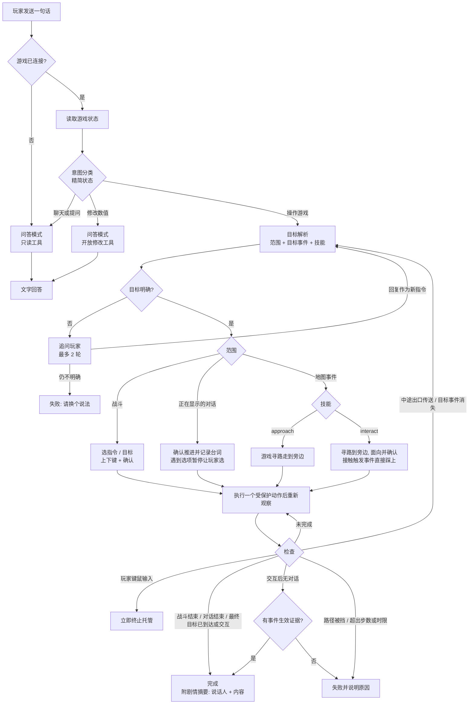

# 游戏辅助自主托管技术方案

> 状态：设计稿  
> 日期：2026-10-06
> 需求：[`../game-assistance.md`](../game-assistance.md)  
> 关联：[`game-agent.md`](./game-agent.md)、[`webmcp.md`](./webmcp.md)

## 1. 决策

在现有 Chaya 助手中扩展通用的托管 Turn。玩家只提交自然语言目标；Host 先观察游戏，模型依据目标与新观察决定下一步，Host 负责工具校验、执行、验证、暂停和终止。不按“代打”“跳剧情”“寻路”等词建立专用工具链或要求玩家选任务类型。

运行策略由 Host 内部决定。只读问题不给写工具；明确要求操作游戏的请求才进入托管循环。判断依据是玩家本轮指令和当前游戏观察，不读取游戏文本作为新的任务指令。无法确定目标或关键选择时询问玩家。通用循环不意味着无限授权：工具白名单、单次动作和总任务边界始终由 Host 执行。

首期托管运行在 App / local 的服务端游戏桥接链路；Edge 的浏览器运行器沿用相同契约，在它具备等价的任务生命周期和游戏连接后接入。模型使用现有 Ollama `tools` / `tool_calls`，不需要模型自带 Agent 循环或额外的“代打”能力。

## 2. 现状与缺口

| 位置                     | 当前实现                                            | 托管所需变化                                                                          |
| ------------------------ | --------------------------------------------------- | ------------------------------------------------------------------------------------- |
| `GameAgentWorkspace.tsx` | 请求固定传 `mode: 'ask'`；展示观察/思考和工具调用。 | 发送自然语言目标，展示推断目标、进展、等待玩家和完成依据；支持重新连接运行中的 Turn。 |
| `turn/route.server.ts`   | 拒绝非 `ask`；SSE 断开即停止。                      | 允许内部托管策略；Turn 生命周期独立于事件订阅；断线后可按事件序号续读。               |
| `turn-runner.server.ts`  | 最多 8 轮工具调用，模型输出正文即可结束。           | 目标建立、短动作循环、证据校验、无进展检测、时间/动作预算、暂停/继续。                |
| `tool-runtime.server.ts` | 提供非破坏性工具并对部分写操作回读。                | 明确读写分级、每轮写动作上限、参数校验、游戏绑定与中止检查；统一返回可比较的观察。    |
| `handlers.ts`            | 状态含场景、地图、队伍、敌人、窗口和对话。          | 补足当前可用指令、目标和代价，以及可识别的战斗实例与结局。                            |
| `history.ts`             | 记录最近 300 条已显示剧情，支持 `afterSeq`。        | 任务起点游标、增量完整性检测；处理重复台词合并导致游标不前进的问题。                  |
| `browserTurn.ts`         | 独立的浏览器工具循环，最多 8 轮。                   | 后续复用相同的任务状态与边界；不能让 Edge 形成另一套游玩语义。                        |

原 [`game-agent.md`](./game-agent.md) 保留 M1/M2 实现基线和整体路线图；自主托管的运行策略、完成判定、事件订阅与停止语义以本文为准。旧方案中按 `mode` 选择工具、模型正文直接结束、SSE 断线取消等规则只描述当前基线，不作为自主托管的实现契约。

## 3. 运行结构

```text
用户自然语言目标
  ↓
Turn API → 按 gameId 建立任务、读取 game.state 与 game.history 游标
  ↓
Goal resolver → 推断目标、范围、完成证据与是否需要追问
  ↓
通用任务循环：观察 → 模型决策 → Host 校验 → 短动作 → 重新观察
  ├─ 证据满足 → 完成并总结
  ├─ 需要玩家 → 暂停，收到回复后继续同一任务
  ├─ 无进展 / 上限 / 断连 → 结束并说明最后状态
  └─ 玩家停止 → 取消后续动作
```

Goal resolver 不做关键词到“战斗执行器”的映射。它消费玩家原话与首次观察，生成内部任务约束：

```ts
type TaskGoal = {
  request: string // 玩家原话，不允许游戏文本改写
  summary: string // UI 展示的简短目标
  scopeDescription: string // 给玩家看的范围说明
  completionEvidence: string[] // 需要在新状态/历史中核实的事实
  openQuestion?: string // 目标不足时询问玩家
}

type TaskBoundary = {
  gameId: string
  startScene: string | null
  startMapId: number | null
  historyStartSeq: number
  battleInstanceId?: string // “当前这场战斗”绑定启动时的实例
  targetEventId?: number // 如“村长”可唯一定位时绑定事件
}
```

`TaskGoal` 是模型建议、Host 保存的任务上下文，不是授权令牌。Host 根据首次观察和玩家目标建立不可由模型修改的 `TaskBoundary`；目标不唯一时先追问。每次写动作前及操作后核对边界：绑定的战斗实例结束后不再写入，目标事件消失或进入未授权场景时暂停。只有玩家后续明确扩大目标，Host 才根据新观察建立新的边界。模型可以改变行动计划，不能自行扩大范围或修改权限。自然语言完成条件无法完全机械证明；Host 至少要求模型给出可定位于最新状态或本轮历史的依据。缺乏依据时只报告进度或“无法确认完成”。

### 3.1 请求处理流程

每次发送先经过两次只读的前置判断，都用结构化输出，不按关键词或语言枚举：

1. **意图分类**（`classifyGameIntent`）：区分操作游戏、修改数值、聊天提问。只输入精简状态（场景、地图名、是否战斗、是否有对话框、选项、附近事件的 id / 名称 / 距离）；队伍、背包、屏幕文字会把 2B–4B 小模型带偏成“聊天”，不得放入。
2. **目标解析**（`resolveGoal`，仅托管路径）：确定范围 `battle` / `visible_dialogue` / `map_event`，从 `nearbyEvents` 中选目标并选择地图技能。结构化输出无效、目标或技能缺失时先把校验问题交给模型补判一次；带线索台词或有多个候选事件时，另核验所选事件的名称是否就是最终目标，防止把提到宝箱的人或无关门口当作宝箱。目标不在当前地图时，可选择有路线依据的出口作为 `transit` 中途步骤；模型选择 `approach` 时再用一个独立的布尔判断确认玩家是否明确要求停在目标旁边。仍不能绑定目标才追问玩家，最多 2 轮。玩家回复作为最新指令重新解析，与原话冲突时以回复为准。逃跑授权由模型依据玩家原话输出 `allowEscape`，不依赖中文关键词。
3. **按调用选择思考模式**：意图分类和目标解析先用快速模式；输出无效后的补判才启用 Ollama `think`。战斗开场指令、逐格移动、QTE 和截图文字转录保持快速，涉及多目标、队伍资源或状态效果的战术选择才启用思考。长剧情摘要可以启用思考；短文本翻译先快速执行，长篇非实时文本或译文复述原文后的重试再启用。开启时移除 `/no_think` 并提高输出预算，避免模型只返回推理内容而没有最终 JSON。模型仍需经过同一套工具、状态与完成证据校验。



托管上限为 80 步、60 个动作、5 分钟；每个写动作带观察令牌与允许效果，状态变化即作废。问答模式只有判为修改数值时才开放写工具。

对玩家的使用建议：一句话说清动作与对象（“跟村长对话”“打开宝箱”“进那扇门”“帮我打这场战斗”“跳过这段剧情并总结”），语言不限；跨地图目标需要当前事件或已记录台词提供可辨认的路线，无法判断出口时会追问；只想靠近时明确说“走到…旁边”；被追问时直接补充目标；托管中不要操作键鼠。意图分类看不到上一轮聊天，“帮我执行一下”“1”这类短回复应改为完整目标。

## 4. Turn 生命周期与接口

### 4.1 请求和状态

沿用 `POST /api/game-agent/turn` 的 Profile、模型、会话和 SSE 格式。新客户端只发送 `prompt`，不要求玩家选择 `ask` / `play`。旧客户端仍可能固定传 `mode: 'ask'`，因此过渡期接受该字段但不把它当作只读权限开关；服务器根据本轮用户意图和首次观察决定是否允许写工具。旧客户端升级后可移除字段。

Turn 增加 `goal`、`boundary`、`phase`、`step`、`actionCount`、`deadline`、`lastObservation`、`historyCursor`、`noProgressCount` 和 `pendingQuestion`。一个 `gameId` 同时只有一个活动 Turn。新的 `waiting_user` 状态保留任务上下文，不释放为可并行的新 Turn；玩家回复后恢复同一任务。

```text
starting → observing → planning → acting → verifying → planning ...
                         └──────────────→ waiting_user → observing
任意活动状态 → completed | stopped | failed | limit_reached
```

新增 `POST /api/game-agent/turn/:turnId/reply`，请求含 `gameId` 与玩家回复。只有该游戏当前 `waiting_user` 的 Turn 可接收，重复回复用 `replyId` 幂等处理。`DELETE /api/game-agent/turn/:turnId` 继续用于停止；停止、回复和读事件都必须校验与启动时相同的游戏绑定和入口权限。

### 4.2 事件与断线

事件增加单调 `seq`，保存一个有界内存事件窗口。`GET /api/game-agent/turn/:turnId/events?after=<seq>` 重放窗口内遗漏事件并继续订阅；`GET /api/game-agent/status` 返回活动 Turn 的 id、阶段和最后事件序号。事件至少包含 `goal.updated`、`phase`、`tool.started`、`tool.completed`、`approval.required`、`turn.completed`、`turn.stopped` 和 `turn.failed`。

SSE 订阅断开仅移除订阅者，不自动取消任务，满足关闭侧栏仍可运行。明确停止、游戏离线/退出、任务超时和服务进程结束才终止执行。事件窗口不足以补齐时，客户端用状态快照重建当前目标和活动工具行，并提示早期细节不可恢复；不能重放写工具。首期任务只在进程内存活，服务重启后不恢复执行。

## 5. 决策与执行

### 5.1 模型输出

首次观察后模型要么给出简短目标和完成依据，要么询问缺失信息；玩家不需为正常目标逐次确认。后续每轮只允许一项写动作，或提出问题，或申请结束。可提供仅在内置 Host 中可见的控制工具 `task.goal`、`task.ask_user`、`task.finish`，与游戏 MCP 工具分开；这些控制工具只表达决策，不直接操作游戏。

模型使用当前观察和本轮历史决定工具，不预生成长按键脚本。写动作执行完由 Host 强制回读。`task.finish` 必须由最新观察或本轮历史验证；普通正文不能宣称托管完成。原生 `tool_calls` 缺失时，Host 以压缩后的当前状态请求 JSON Schema 单步决策，验证动作类别后才派发；仍无有效决策则失败。对话无选项时只提供推进动作，出现选项时只允许请求玩家决定。

地图上针对事件的目标通过“地图技能”表达（`services/game-agent/map-goal.ts` 的 `MAP_SKILLS`）：`approach` 只走到事件旁，`interact` 走到旁边、面向并按确认。RPG Maker 中对话、开宝箱、调查、拾取都是同一种触发，因此不按动词或语言枚举。Goal resolver 用结构化输出选择技能，`targetEventId` 被约束为当前 `nearbyEvents` 的 id；模型依据事件名、行走图（`sprite`）、触发方式（`trigger`）、首句台词（`hint`）和方位跨语言匹配目标。行走使用带 `guard`（观察令牌、地图、`navigate`）的 `player.moveTo`，游戏每次只按寻路结果走一格，Host 回读状态后再决定下一格；下一格有非目标接触事件时停止该路径，Host 依次尝试目标四周的候选格。到达后再用受保护的单键转向并确认，仅 `interact` 授权 `interact_event` 效果。接触触发（`player_touch` / `event_touch`）的事件如门、出口，`interact` 尝试走上去，不可通行时用方向键碰触；仅目标事件启动、对话出现或目标触发传送等可观察结果可以证明触发，走到事件格本身不足以证明交互完成。无可观察效果的静默交互报告无法确认。托管期间检测到玩家可信键鼠输入时直接终止任务，不再暂停询问。新增技能时扩展 `MAP_SKILLS` 及其 Host 执行分支。

中途出口只推进路线，不满足“打开宝箱”等最终目标。地图变化或当前目标消失后，Host 重新观察当前地图，保留玩家原始目标并重新解析下一步；最多重新规划 4 次，已尝试的中途出口不能重复，无法找到可靠路线时追问或停止并报告最后确认的位置。只有最终事件的交互或到达证据才能发出 `verified` 完成事件。托管是逐动作回读和纠偏，不是后台持续监听；用户接管、游戏断连或时限到达会终止本轮。

### 5.2 Host 循环

```ts
async function runManagedTurn(task, signal) {
  let observed = await observe(task.gameId, task.historyCursor)
  task.goal = await resolveGoal(task.request, observed)
  if (task.goal.openQuestion) return waitForUser(task.goal.openQuestion)
  task.boundary = bindBoundary(task.gameId, task.goal, observed)

  while (withinBudget(task)) {
    throwIfAborted(signal)
    const decision = await modelDecide(task.goal, observed, task.progress, allowedTools(task))
    if (decision.kind === 'ask_user') return waitForUser(decision.question)
    if (decision.kind === 'finish') return finishOnlyIfVerified(decision, observed, task)
    const action = validateAction(decision, task, observed) // 含选中项后果与任务边界
    const before = observed
    const outcome = await executeGuardedAndObserve(action, {
      controlToken: before.controlToken,
      boundary: task.boundary,
      signal,
    }) // 游戏侧原子校验后执行；动作结束后尽力只读回查
    if (outcome.observation) observed = outcome.observation
    if (signal.aborted) return stoppedWithObservedOrUnknown(task, outcome)
    if (outcome.status === 'STATE_CHANGED') {
      observed = await observe(task.gameId, task.historyCursor)
      continue // 旧决策失效，不执行剩余工具
    }
    if (!outcome.observation) return stopWithUnknownEffect(task, outcome)
    updateProgress(task, before, outcome.result, observed)
    if (task.noProgressCount >= 3) return stopWithProgress(task)
  }
  return stopAtLimitWithProgress(task)
}
```

预算由 Host 计数，至少包含最大模型轮次、写动作次数、累计按键数、单动作时长、总任务时长和连续无进展次数。初值沿用需求文档的 20 轮、单次最多 8 个按键动作、5 分钟和 3 次无进展；实现时以这些值作为上限而非模型可请求的参数。长任务可由玩家在报告当前进度后发起续做，不自动重置预算。

一轮中若模型返回多个写工具调用，Host 只执行第一项，其余返回未执行结果并重新观察；不能把旧观察下的多个动作连成不可中断的计划。`chaya_live_play` 虽允许更长序列，内置 Host 仍收紧为最多 8 步。若要在序列的每一步前检查停止与场景状态，需扩展插件的 `input.sequence`；在此之前托管循环每次只发送一个按键动作。模型传入的 `gameId` 被覆盖为 Turn 绑定值。

`executeGuardedAndObserve` 在插件中将观察令牌和语义后果检查放在动作派发前的同一个同步步骤；令牌不符时返回 `STATE_CHANGED`，不派发输入。动作一旦开始，无论成功、报错或收到停止，Host 都在动作结算后用独立的短时只读请求尽力回查；该回查不受已取消的写操作信号阻断，也不得启动新的写动作。回查失败时记录 `effectUnknown`，最终消息说明最后可靠观察发生在动作前，不能把它称为动作后的状态。动作在超时后仍未结算时同样标记结果未知。

### 5.3 进展与完成验证

观察指纹使用场景、地图与坐标、活动窗口、对话、队伍/敌人状态、战斗实例、历史游标和关键屏幕文字；忽略时间戳、动画帧和未影响任务的字段。指纹变化是进展线索，不等于完成。相同错误重复两次或连续三次无有效进展后停止，避免在菜单上盲按。

完成判定以“目标 + 可观察证据”为准。通用校验先确认引用来自当前 Turn 且是动作后的观察；领域状态只提供事实，不决定固定操作流程。例如：

- 战斗：`battleInstanceId` 与本次战斗结果对应；胜利、失败或逃跑要分别报告。场景离开战斗但没有结果记录时不得推定胜利。
- 剧情：本轮新增的台词/选项记录与最终状态构成摘要依据；记录缺失只能给部分摘要。
- 移动：目标可唯一定位时，最终地图与坐标达到目标附近；若被传送或目标消失，重新规划或追问。

## 6. 游戏侧观察契约

### 6.1 战斗与交互

在 `game.state` 的现有 `scene`、`battle`、`windows` 基础上补充当前可选择的命令名称/符号、作用角色、可选敌我目标、技能或道具可用性及代价。只读取 RPG Maker MV/MZ 标准 API 和当前可见窗口；无法可靠读取的字段返回 `null`，不据窗口位置猜测选项。引入本次游戏进程内单调的 `battleInstanceId`，将开始与结局记录到状态和 `game.history`，供结局与对应战斗配对。重新加载存档后重新建立实例边界。

战斗状态读取得可保持轻量；大型技能列表按当前窗口和选中角色裁剪。工具执行后等待游戏进入稳定可交互状态，再回读；不能用固定毫秒延迟代替状态检查，等待仍受单动作超时约束。

`game.state` 还需返回 `controlToken`，由游戏侧根据场景、地图、战斗实例、交互阶段、活动窗口及选中项、相关资源状态与玩家输入纪元生成。Host 在模型工具调用通过校验后，把令牌与任务边界注入 `input.press`、`input.tap` 和托管移动的游戏桥接指令；这两个字段不暴露为模型可填写参数。插件在派发前同步重读关键状态并比较，避免模型思考期间玩家或游戏事件改变了选中项。令牌只用于验证当前决策，不能跨动作复用。对于按住键和多步序列，插件需在每步间支持取消与重新校验；未实现前托管只发单步输入。

### 6.2 剧情记录

任务开始时读取 `game.history` 的 `lastSeq` 作为起点；每段短对话操作后读取 `afterSeq` 的新增条目，原样保留到本轮任务缓存，再更新游标。请求上限取 300；若首条新记录的序号大于期望、环形缓冲覆盖起点或本轮缓存超预算，标记 `historyIncomplete`，总结必须显式说明范围。

现有连续相同台词会合并为 `repeat`，可能更新内容却不增加 `seq`。需给每次显示增加单调事件游标，或让增量读取返回合并条目的修订信息，确保任务起点后重复出现的台词可被感知。`afterSeq` 的语义与客户端兼容性在更改前通过协议测试固定。

直接执行跳过/清除事件不会触发全部已显示台词记录，因此此需求使用逐段快进。遇到未授权选项、战斗、商店、读档等场景时由当前观察触发暂停或交还控制，不继续盲按。翻译文本优先使用记录中已有译文；原文和译文都缺失时不生成虚构剧情。

### 6.3 限时交互与快速反应

普通托管循环每步都经过游戏桥、模型和写后回读，不能承担亚秒级 QTE。模型负责理解玩家目标与较慢的战术选择；需要即时反应时，Host 在当前战斗实例内布防，游戏进程按帧读取明确的反应信号并直接派发一次短按键。布防与普通输入共用战斗实例、地图和玩家输入纪元边界；换场景、玩家接管、等待玩家、任务停止或超时立即撤销。QTE 执行后仍由普通循环回读结果，不把“已发键”当作“已成功”。

当前可读信号由游戏侧适配器提供 `window.ChayaAgentQteSource(): { id, key, startedAt?, expiresAt } | null`。`id` 标识一次提示，`key` 必须属于本轮允许的按键，时间戳使用 `Date.now()` 毫秒；同一 `id` 只响应一次。适配器可在函数的 `lastResult` 属性回报 `{ id, result: 'success' | 'missed' }`，用于区分发键和游戏实际判定。没有该信号的游戏仍走普通托管，不宣称支持其 QTE。仅在画布里绘制文字或图案、无法从游戏状态读取目标键的 QTE，需要另加可靠的视觉识别适配器，并在真实游戏里测识别率、误按率及触发到发键的 P95 延迟。

## 7. 权限、暂停与恢复

写工具仍从现有目录与第一方插件声明生成白名单。Host 在调用前再次校验工具名、参数 schema、绑定游戏和危险级别；模型能看到某个工具不等于已获玩家授权。还要对实际输入作语义预检：方向键在菜单中通常只改变选中项，但 `ok`、点击或地图移动可能确认剧情选项、使用道具、存档或触发事件。插件根据当前活动窗口、选中项和目标解析预期后果，返回 `navigate`、`advance_dialogue`、`battle_command`、`spend_resource`、`choose_branch`、`save_load` 等类别；未知窗口或无法确定后果返回 `unknown`。`unknown` 和未授权的有后果类别必须在派发前暂停，不能把 `chaya_live_press` 整体标为安全。插件与 Host 均按同一策略校验，防止预检与执行之间状态变化。

常规移动、无选项对话推进和已识别的普通战斗指令可在明确目标内执行；消耗资源、剧情分支、存档/读档、传送、修改状态和强制胜败根据玩家本轮明确授权及当前后果请求确认，或暂不开放。授权绑定具体动作类别和范围，不由游戏文本或模型自行扩大。对无法可靠识别选中项的自定义窗口，暂停并交还玩家。

`waiting_user` 暂停模型调用和后续写工具，保存问题、选项、最近状态与待执行动作摘要；回复后先重新观察，再决定是否仍适用原计划。托管期间只监听发往游戏区域的玩家可信键鼠输入，排除 Chaya 助手输入框和浮层，也不把助手合成的按键当成玩家输入。玩家输入优先，任务立即终止并使旧 `controlToken` 失效，不阻断玩家操作；进行中的 `player.moveTo` 同步中断。玩家需要时重新发起任务。

停止的 `AbortSignal` 在调用模型和派发每个新动作前检查；已发给游戏的单个原子动作可能完成。Host 等待该动作结算后尽力做一次有超时的只读回查，再报告停止；若游戏已断连或回查失败，标明动作效果未知。玩家停止后不得因这次回查继续模型循环或发出新游戏动作。

## 8. 分阶段交付与验证

1. **通用托管纵切**：自然语言入口、首次观察与目标边界、战斗实例和结局记录、按键后果预检、观察令牌、Host 预算、一次一写和写后验证、进度事件、停止。用“帮我代打”在已有战斗中验证自主识别与本场结束；非战斗时应追问目标。未知或未授权的动作在此阶段结束任务并说明原因。上述执行前保护须与首次可写托管同时交付。
2. **交互与证据**：补足技能、道具、目标等战斗观察和剧情增量游标；实现更丰富的完成证据校验、选项/资源决策的暂停与回复。用战斗、含选项对话、受阻寻路三个不同场景验证同一循环，不添加场景专用执行器。
3. **生命周期与多端**：Turn 与 SSE 订阅解耦、事件续读、侧栏关闭后恢复展示，再接入 Edge 等价运行器；以断线、游戏退出、服务重启和重复回复验证幂等与终止语义。

测试重点是 Host 不执行第二个未经重新观察的写动作、确认键在选项/消耗品/存档窗口被正确拦截、观察后被玩家改变的选中项导致 `STATE_CHANGED`、绑定战斗结束后不再输入、模型提前声明完成时仍要求证据、剧情记录缺口不被当作完整摘要，以及暂停/停止后不再启动新工具。单个动作已发出时停止，需分别验证回读成功和效果未知。端到端验收使用可控 RPG Maker fixture，同时在真实 MV/MZ 游戏中检查状态字段的兼容性。格式、类型和测试命令沿用仓库的 `pnpm format` / `lint` / `typecheck` / `ok`。
